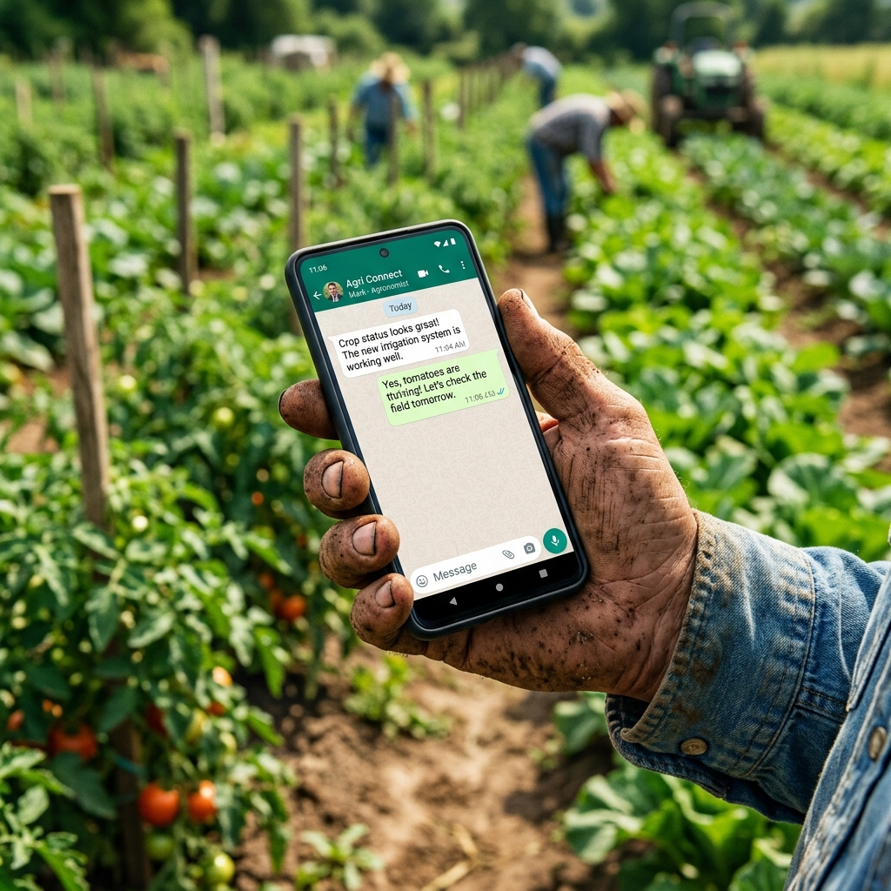

# 🌱 CropCare AI — AI-Powered Crop Disease Detection & Farmer Advisory System

> **An intelligent full-stack agricultural assistant empowering farmers with real-time visual crop disease diagnosis via Google Gemini Vision AI, interactive agronomy advisory chat, and historical disease tracking.**

---

## 🌐 Live Demo

- **Frontend Application (Vercel):** [https://ai-crop-disease-advisory-system.vercel.app](https://ai-crop-disease-advisory-system.vercel.app)
- **Backend REST API (Render):** [https://ai-crop-disease-advisory-system.onrender.com](https://ai-crop-disease-advisory-system.onrender.com)
- **API Health Check:** [https://ai-crop-disease-advisory-system.onrender.com/api/health](https://ai-crop-disease-advisory-system.onrender.com/api/health)

---


## 📸 Screenshots

### 1. Landing Page & Real-Time System Dashboard

*Hero section with instant navigation, key feature highlights, and real-time backend health & diagnostic statistics.*

### 2. AI-Powered Visual Crop Disease Detection

*Multimodal leaf analysis providing disease identification, confidence percentage, severity rating, and customized treatment plans.*

### 3. Interactive Farmer Advisory Chatbot

*Intelligent conversational assistant offering actionable guidance on pest management, organic fertilizers, and irrigation.*

### 4. Diagnosis History & Treatment Monitoring

*Historical record keeping with search, status tracking (Detected, Under Treatment, Treated), and persistent database storage.*

---

## ✨ Features

- 🌿 **Visual Disease Detection via Gemini Vision AI**: Upload leaf/plant images (JPEG, PNG, WebP) to receive automated disease classification, confidence score (0–100%), severity rating (Low/Medium/High/Critical), chemical treatments, and organic remedies.
- 💬 **Conversational Farmer Advisory**: Ask complex agronomic questions and receive tailored, structured advice customized for Indian agriculture and regional crop seasons.
- 📊 **Diagnosis History & Management**: Full CRUD capabilities to track crop health trends over time, update treatment status, search records by keyword, and delete outdated entries.
- 🔒 **Dual Authentication & Security**:
  - Email/Password authentication with JWT and bcrypt password hashing.
  - One-click GitHub OAuth 2.0 integration via Passport.js.
  - Multi-tier rate limiting (Auth: 20 req/15 min, AI: 50 req/15 min, Global: 100 req/15 min).
- 🌓 **Modern Responsive UI/UX**:
  - Dark mode and Light mode toggle with persistent state.
  - Fully responsive on mobile, tablet, and desktop viewports.
  - Glassmorphic design with animated toast notifications and loading skeletons.
  - Client-side image compression (Canvas-based) for low-bandwidth rural mobile networks.

---

## 🛠️ Tech Stack

| Layer | Technology | Details |
|---|---|---|
| **Frontend** | React 18, Vite 5, Tailwind CSS | Single Page App (SPA), React Router v6, Context API (Auth & Theme) |
| **Backend** | Node.js, Express.js | Modular MVC architecture, RESTful API, Error handling middleware |
| **Database** | MongoDB Atlas (M0), Mongoose 8 | NoSQL document database, Schema validation, Foreign references |
| **AI / Multimodal** | Google Gemini 1.5 Flash / 3.1 Flash Lite | `@google/generative-ai` SDK, Structured JSON image analysis & NLP |
| **Authentication** | JWT, Passport.js, bcryptjs | Stateless Bearer token auth + GitHub OAuth 2.0 session handling |
| **Security & Utilities** | express-rate-limit, cors, dotenv | DDOS & quota protection, CORS whitelisting, environment segregation |
| **Hosting & CI/CD** | Vercel (Frontend), Render (Backend) | Automatic Git deployments, production environment variable binding |

---

## 🚀 Setup Instructions

Follow these step-by-step instructions to clone, configure, and run the project locally.

### Prerequisites
- **Node.js**: v18.0.0 or higher ([Download Node.js](https://nodejs.org/))
- **Git**: Installed and configured on your system
- **MongoDB**: A free MongoDB Atlas cluster ([Sign up](https://www.mongodb.com/cloud/atlas)) or local MongoDB instance
- **Google Gemini API Key**: Free API key from [Google AI Studio](https://aistudio.google.com/)

---

### Step 1: Clone the Repository
```bash
git clone https://github.com/samarthjoshi01/AI-Crop-Disease-Advisory-System.git
cd "AI-Crop-Disease-Advisory-System"
```

---

### Step 2: Configure and Run Backend

1. Navigate to the `backend` directory:
   ```bash
   cd backend
   ```

2. Install backend dependencies:
   ```bash
   npm install
   ```

3. Create your `.env` configuration file:
   ```bash
   cp .env.example .env
   ```

4. Populate the `.env` file with your credentials:
   ```env
   # Server Configuration
   PORT=5000
   NODE_ENV=development
   FRONTEND_URL=http://localhost:5173

   # MongoDB Atlas Connection URI
   MONGO_URI=mongodb+srv://<username>:<password>@cluster0.xxxxx.mongodb.net/cropcare-ai?retryWrites=true&w=majority

   # JWT Authentication Secret
   JWT_SECRET=your_super_secret_jwt_key_min_32_characters
   JWT_EXPIRE=7d

   # GitHub OAuth (Optional for local, required for GitHub login)
   GITHUB_CLIENT_ID=your_github_oauth_client_id
   GITHUB_CLIENT_SECRET=your_github_oauth_client_secret
   GITHUB_CALLBACK_URL=http://localhost:5000/api/auth/github/callback

   # Session Secret (for Passport OAuth)
   SESSION_SECRET=your_session_secret_passphrase

   # Google Gemini AI API Key (Required for AI detection & chat)
   GEMINI_API_KEY=AIzaSyYourGeminiApiKeyHere
   ```

5. Seed the database with initial crops, diagnoses, and advisories:
   ```bash
   npm run seed
   ```

6. Start the backend development server:
   ```bash
   npm run dev
   ```
   *The backend API will start at `http://localhost:5000`.*

---

### Step 3: Configure and Run Frontend

1. Open a new terminal in the project root directory:
   ```bash
   # From root folder
   npm install
   ```

2. (Optional) Create a `.env` file in the root if pointing to a non-default backend port:
   ```env
   VITE_API_URL=http://localhost:5000/api
   ```

3. Start the Vite development server:
   ```bash
   npm run dev
   ```
   *The frontend application will be live at `http://localhost:5173`.*

---

## 📡 API Documentation

Base URL: `/api`

### 1. Authentication Endpoints

| Method | Endpoint | Description | Auth Required |
|---|---|---|---|
| `POST` | `/api/auth/register` | Register new user account | No |
| `POST` | `/api/auth/login` | Log in with email and password | No |
| `GET` | `/api/auth/me` | Retrieve profile of logged in user | Yes (JWT) |
| `GET` | `/api/auth/github` | Initiate GitHub OAuth 2.0 flow | No |
| `GET` | `/api/auth/github/callback` | OAuth redirect callback handler | No |

#### Example: Register User
```bash
POST /api/auth/register
Content-Type: application/json

{
  "name": "Ramesh Kumar",
  "email": "ramesh@example.com",
  "password": "Password123!"
}
```
**Response (`201 Created`):**
```json
{
  "success": true,
  "data": {
    "user": {
      "id": "664f1a2b8c9d0e1f2a3b4c5d",
      "name": "Ramesh Kumar",
      "email": "ramesh@example.com",
      "authProvider": "local"
    },
    "token": "eyJhbGciOiJIUzI1NiIsInR5cCI6IkpXVCJ9..."
  }
}
```

---

### 2. AI Multimodal & Advisory Endpoints

| Method | Endpoint | Description | Auth Required |
|---|---|---|---|
| `POST` | `/api/ai/detect-image` | Visual crop disease diagnosis from base64 image | Yes (JWT) |
| `POST` | `/api/ai/advisory` | Intelligent agricultural Q&A response | Yes (JWT) |
| `POST` | `/api/ai/diagnose` | Text-based disease and symptom analysis | Yes (JWT) |

#### Example: Detect Crop Disease from Image
```bash
POST /api/ai/detect-image
Authorization: Bearer <token>
Content-Type: application/json

{
  "image": "iVBORw0KGgoAAAANSUhEUgAA...",
  "mimeType": "image/jpeg",
  "cropName": "Tomato"
}
```
**Response (`201 Created`):**
```json
{
  "success": true,
  "data": {
    "detection": {
      "cropName": "Tomato",
      "diseaseName": "Early Blight (Alternaria solani)",
      "confidence": 94.2,
      "severity": "Medium",
      "description": "Concentric dark brown rings with target-board appearance on lower leaves.",
      "treatment": "Apply Mancozeb 75% WP @ 2g/liter or Copper Oxychloride 50% WP @ 3g/liter.",
      "preventiveMeasures": "Ensure crop rotation with non-solanaceous crops, avoid overhead watering.",
      "isHealthy": false
    },
    "diagnosis": {
      "id": "66503c1a9d8e7f1b2c3d4e5f",
      "cropName": "Tomato",
      "diseaseName": "Early Blight",
      "confidence": 94.2,
      "status": "Detected"
    }
  }
}
```

---

### 3. Diagnosis Management Endpoints

| Method | Endpoint | Description | Auth Required |
|---|---|---|---|
| `GET` | `/api/diagnoses` | List user's diagnosis records | Yes (JWT) |
| `GET` | `/api/diagnoses/search?q={term}` | Search diagnoses by crop, disease, status | Yes (JWT) |
| `GET` | `/api/diagnoses/:id` | Get single diagnosis detail | Yes (JWT) |
| `POST` | `/api/diagnoses` | Create a manual diagnosis entry | Yes (JWT) |
| `PUT` | `/api/diagnoses/:id` | Update diagnosis status or treatment | Yes (JWT) |
| `DELETE` | `/api/diagnoses/:id` | Remove diagnosis record | Yes (JWT) |

---

### 4. Advisory History Endpoints

| Method | Endpoint | Description | Auth Required |
|---|---|---|---|
| `GET` | `/api/advisories` | List past advisory Q&A sessions | Yes (JWT) |
| `POST` | `/api/advisories` | Submit standard advisory query | Yes (JWT) |
| `DELETE` | `/api/advisories/:id` | Remove advisory item | Yes (JWT) |

---

### 5. System Health Endpoint

| Method | Endpoint | Description | Auth Required |
|---|---|---|---|
| `GET` | `/api/health` | Service uptime and heartbeat | No |

---

## 🏗️ Architecture & Folder Structure

```
AI-Crop-Disease-Advisory-System/
├── backend/
│   ├── config/
│   │   ├── db.js                 # MongoDB Mongoose connection handler
│   │   └── passport.js           # GitHub OAuth 2.0 strategy configuration
│   ├── controllers/
│   │   ├── authController.js     # User registration, login, profile resolution
│   │   ├── aiController.js       # Gemini image detection & chat handlers
│   │   ├── diagnosisController.js# Diagnosis CRUD & search controller
│   │   ├── advisoryController.js # Advisory Q&A controller
│   │   └── cropController.js     # Crop catalog controller
│   ├── middleware/
│   │   ├── auth.js               # JWT verification & route protection
│   │   └── errorHandler.js       # Centralized error handler & status mapping
│   ├── models/
│   │   ├── User.js               # User model with bcrypt pre-save hashing
│   │   ├── Crop.js               # Crop entity schema
│   │   ├── Diagnosis.js          # Disease diagnosis record schema
│   │   └── Advisory.js           # Farmer advisory record schema
│   ├── routes/
│   │   ├── authRoutes.js         # /api/auth routes
│   │   ├── aiRoutes.js           # /api/ai routes (rate-limited)
│   │   ├── diagnosisRoutes.js    # /api/diagnoses routes
│   │   ├── advisoryRoutes.js     # /api/advisories routes
│   │   └── cropRoutes.js         # /api/crops routes
│   ├── scripts/
│   │   └── seed.js               # Database seeding utility
│   ├── services/
│   │   └── geminiService.js      # Google Generative AI integration layer
│   ├── .env.example              # Template environment variables
│   ├── package.json              # Backend dependencies & scripts
│   └── server.js                 # Express application root & middleware setup
│
├── public/
│   └── images/                   # Static mockups and screenshot assets
│
├── src/
│   ├── api/
│   │   └── apiClient.js          # Unified Fetch wrapper with JWT injection
│   ├── components/
│   │   ├── ui/                   # Reusable UI primitives (Button, Modal, Toast, Loader)
│   │   ├── ErrorBoundary.jsx     # React runtime error boundary
│   │   ├── Footer.jsx            # Application footer component
│   │   ├── Hero.jsx              # Landing page hero component
│   │   ├── Navbar.jsx            # Responsive navigation & user state
│   │   ├── ProtectedRoute.jsx    # Auth guard wrapper for private routes
│   │   └── ThemeToggle.jsx       # Dark/Light mode switcher
│   ├── contexts/
│   │   ├── AuthContext.jsx       # Global user authentication context & storage
│   │   └── ThemeContext.jsx      # Theme context (dark/light mode)
│   ├── pages/
│   │   ├── Home.jsx              # Landing page & dashboard
│   │   ├── DiseaseDetection.jsx  # Gemini Vision AI image upload & diagnosis
│   │   ├── Advisory.jsx          # Interactive AI agronomy chatbot
│   │   ├── History.jsx           # Diagnosis records table & status updates
│   │   ├── About.jsx             # Project background and specifications
│   │   ├── Login.jsx             # User sign-in & GitHub OAuth button
│   │   ├── Register.jsx          # User registration
│   │   └── OAuthCallback.jsx     # GitHub OAuth redirect handler
│   ├── App.jsx                   # Main routing & provider composition
│   ├── index.css                 # Tailwind CSS directives
│   └── main.jsx                  # React DOM mount point
│
├── index.html                    # HTML entry template
├── tailwind.config.js            # Tailwind styling configuration
├── vite.config.js                # Vite build and proxy settings
├── vercel.json                   # Vercel SPA routing redirects
└── README.md                     # Project documentation
```

---

## ⚠️ Known Limitations

1. **Render Free-Tier Spin-Down**: The backend API is hosted on Render's free tier, which enters sleep mode after 15 minutes of inactivity. The initial cold request may take **30–50 seconds** to spin up; subsequent requests respond in sub-seconds.
2. **Gemini Free-Tier Rate Limits**: Google Gemini API enforces quota limits (15 Requests Per Minute on free tier). The backend includes built-in rate-limiting and fallback handling to protect quotas.
3. **MongoDB Atlas M0 Tier**: Storage is capped at 512 MB, suitable for development and portfolio demonstration.
4. **Offline Capability (Roadmap)**: Currently requires active internet connection for Gemini Vision analysis. Offline cached PWA mode is planned for future releases.

---

## 👏 Credits & Acknowledgements

- **Technology Business Incubator (TBI), Graphic Era University**: For providing mentorship, resources, and guidance throughout the capstone program.
- **Google DeepMind & Google AI Studio**: For the Google Generative AI (`@google/generative-ai`) SDK and Gemini multimodal models.
- **Open-Source Community**:
  - React & Vite ecosystem
  - Tailwind CSS for responsive styling
  - Express.js and Mongoose community
  - Passport.js for OAuth 2.0 integration

---

*Developed by [Samarth Joshi](https://github.com/samarthjoshi01) — TBI-GEU Internship Capstone Project.*
